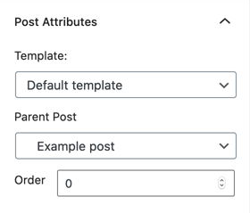
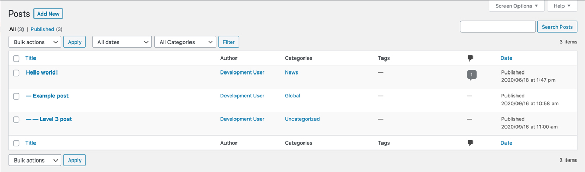
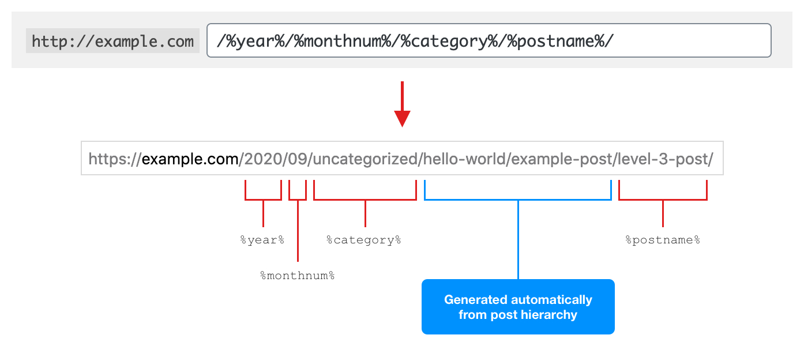

# Add hierarchy to WordPress built-in posts
By default, the built-in `post` post type in WordPress doesn't allow for hierarchical posts. This is often not a problem, but say you have multiple chapters that you want organised under a main post... there currently is no way to do this out of the box. This plugin aims to fix this.

What the plugin does is add the "Page Attributes" metabox to posts, adds parent selector to bulk/quick edit, and modifies permalinks to include the parent slugs but respects the permalink structure found under `Settings > Permalinks`.

Note that [`flush_rewrite_rules()`](https://developer.wordpress.org/reference/functions/flush_rewrite_rules/) is called on plugin activation to handle the new post permalink structure. 

---

**Example of the post metabox**

---

**Example of post hierarchy**

---

**Example of respecting permalink structure**

---
